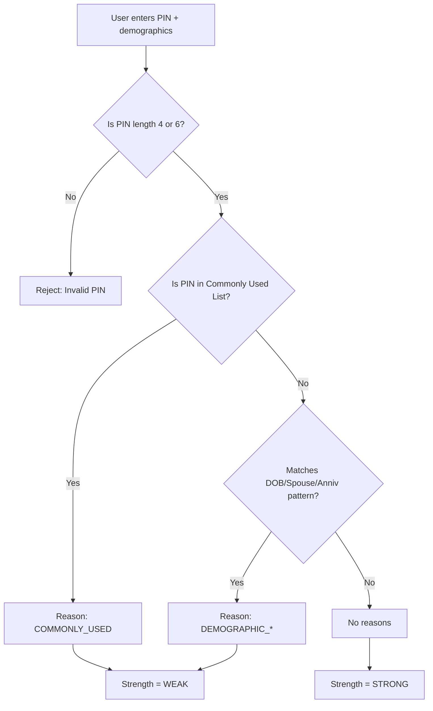

# 🔐 MPIN Strength Analyzer

[](https://mpin-analyzer-3.onrender.com)  
[](https://colab.research.google.com/github/rimi-majumdar/mpin-analyzer/blob/main/MPIN_Task.ipynb)  
*(Click the badge to try the live app or open the notebook in Colab!)*

---

## 📌 Overview
The **MPIN Strength Analyzer** is an interactive web app that evaluates the strength of **4-digit and 6-digit MPINs**.  
It checks whether a PIN is:
- ✅ Commonly used  
- ✅ Derived from personal demographics (DOB, spouse DOB, anniversary)  

If the PIN is **weak**, the app also explains **why**.


---

## 🎥 Live Demo
👉 **Try it here:** [MPIN Analyzer App](https://mpin-analyzer-3.onrender.com)

---

## ⚡ Features
- 🔢 Supports 4-digit and 6-digit PINs  
- 📅 Detects weak MPINs based on demographic patterns  
- 🚫 Flags commonly used PINs  
- 🧾 Provides reasons for weakness  
  - `COMMONLY_USED`  
  - `DEMOGRAPHIC_DOB_SELF`  
  - `DEMOGRAPHIC_DOB_SPOUSE`  
  - `DEMOGRAPHIC_ANNIVERSARY`  
- 🎨 Simple, user-friendly frontend with Streamlit  
- 🧪 20+ automated test cases included  

---

## 🧩 Flowchart of Evaluation



---

## 📂 Project Structure

```
mpin-analyzer/
├── app.py               # Streamlit frontend
├── mpin_analyzer.py     # Core logic
├── requirements.txt     # Dependencies
├── data/
│   ├── common_pins_4.txt
│   └── common_pins_6.txt
├── tests/
│   └── test_mpin.py     # 20+ test cases
└── README.md
```

---

## 🚀 Getting Started

### 🔹 Run Locally

```bash
# Clone repository
git clone https://github.com/rimi-majumdar/mpin-analyzer.git
cd mpin-analyzer

# Install dependencies
pip install -r requirements.txt

# Run Streamlit app
streamlit run app.py
```

App will be available at: [http://localhost:8501](http://localhost:8501)

---

### 🔹 Deploy on Render (current live deployment)

1. Create new Web Service → Connect GitHub repo  
2. Set **Build Command**:
   ```bash
   pip install -r requirements.txt
   ```
3. Set **Start Command**:
   ```bash
   streamlit run app.py --server.port=$PORT --server.address=0.0.0.0
   ```
4. Deploy & open your live URL  

👉 Already live at: [https://mpin-analyzer-3.onrender.com](https://mpin-analyzer-3.onrender.com)

---

## 🧪 Tests

```bash
pytest tests/
```

---

## 🙌 Credits
Built with ❤️ using **Python + Streamlit**  
Assignment inspired by **OneBanc Technologies**

---

